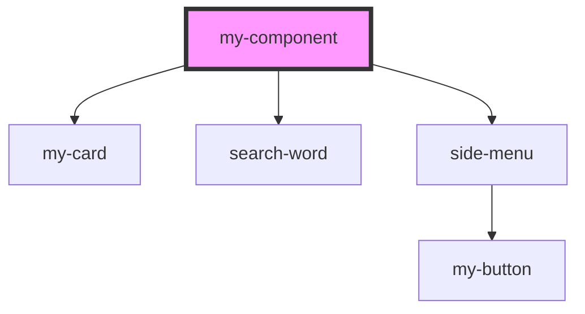

# my-component

<!-- Auto Generated Below -->

## Dependencies

### Depends on

- [my-card](../my-card)
- [search-word](../search-word)
- [side-menu](../side-menu)

### Graph

----------------------------------------------

*Built with [StencilJS](https://stenciljs.com/)*
