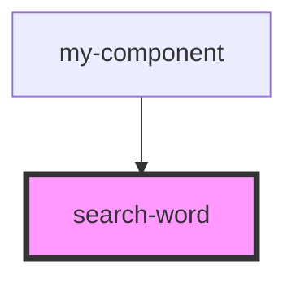

# search-word

<!-- Auto Generated Below -->

## Properties

| Property     | Attribute     | Description | Type     | Default     |
| ------------ | ------------- | ----------- | -------- | ----------- |
| `searchText` | `search-text` |             | `string` | `undefined` |

## Events

| Event                    | Description | Type                  |
| ------------------------ | ----------- | --------------------- |
| `searchWordNameSelected` |             | `CustomEvent<string>` |

## Dependencies

### Used by

 - [my-component](../my-component)

### Graph

----------------------------------------------

*Built with [StencilJS](https://stenciljs.com/)*
